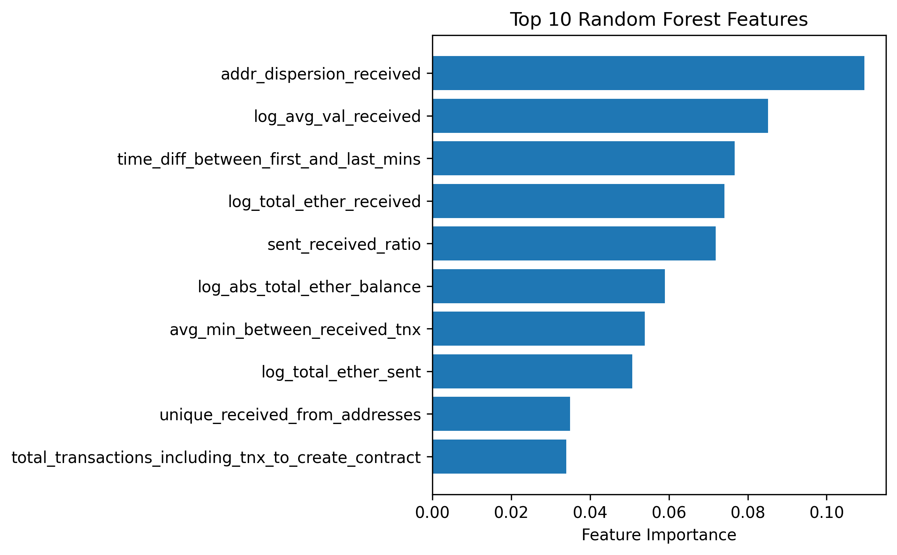

# Обнаружение Мошеннических Ethereum-Кошельков

## Введение

Данный проект представляет собой end-to-end pipeline машинного обучения для выявления мошеннических Ethereum-кошельков на основе поведенческих и транзакционных признаков, полученных из данных блокчейна.

Проект включает:
- ETL-процесс и feature engineering
- Построение нескольких моделей машинного обучения
- Сравнение и оценку моделей
- Анализ глобальной важности признаков
- Присвоение fraud risk score на уровне кошельков

Финальным результатом проекта является датасет с оценкой fraud risk score для каждого кошелька, предназначенный для risk-based monitoring и приоритизации расследований.

---

# Датасет

В проекте используется датасет Kaggle Ethereum Fraud Detection Dataset:

- Источник датасета:  
https://www.kaggle.com/datasets/vagifa/ethereum-frauddetection-dataset

- Локальный путь к датасету:

```text
./data/raw_ethereum_wallet_dataset.csv
```

---

# Описание Данных

Датасет содержит поведенческие и транзакционные признаки Ethereum-кошельков, связанных как с легитимной, так и с мошеннической активностью.

Категории признаков включают:
- частоту и временные характеристики транзакций
- показатели баланса кошелька
- особенности отправки и получения транзакций
- активность ERC20-токенов
- паттерны взаимодействия адресов
- сетевые и поведенческие индикаторы

Целевая переменная:
- `flag`
  - `1` = мошеннический кошелек
  - `0` = легитимный кошелек

---

# Структура Проекта

```text
ethereum-wallet-fraud-detection/
│
├── data/
│   ├── raw_ethereum_wallet_dataset.csv
│   ├── processed_wallet_fraud_dataset.parquet
│   └── risk_scored_wallets.csv
│
├── notebooks/
│   ├── ethereum_wallet_fraud_etl.ipynb
│   └── ethereum_wallet_fraud_modeling.ipynb
│
├── images/
│   ├── model_comparison.png
│   ├── rf_feature_importance.png
│   └── risk_distribution.png
│
└── README.md
```

---

# ETL Процесс

ETL pipeline реализован в:

```text
./notebooks/ethereum_wallet_fraud_etl.ipynb
```

Основные этапы ETL:
- очистка данных
- обработка пропущенных значений
- проверка дубликатов
- feature engineering
- логарифмические преобразования
- создание ratio-based поведенческих признаков
- подготовка датасета для машинного обучения

Обработанный датасет:

```text
./data/processed_wallet_fraud_dataset.parquet
```

---

# Модели Машинного Обучения

В проекте были реализованы и оценены следующие модели:

1. Logistic Regression  
2. Decision Tree  
3. Random Forest  
4. Gradient Boosting  

Процесс моделирования реализован в:

```text
./notebooks/ethereum_wallet_fraud_modeling.ipynb
```

---

# Сравнение Производительности Моделей

Модели оценивались с использованием следующих метрик:
- Accuracy
- Precision
- Recall
- F1-score
- ROC-AUC

Модель Random Forest была выбрана в качестве основной благодаря оптимальному балансу между эффективностью выявления мошенничества (recall) и контролем ложноположительных срабатываний (precision).

## Таблица Сравнения Моделей

| Model | Accuracy | Precision | Recall | F1-score | ROC-AUC |
|---|---:|---:|---:|---:|---:|
| ⭐ **Random Forest** | **0.959** | **0.916** | **0.898** | **0.907** | **0.989** |
| Gradient Boosting | 0.963 | 0.955 | 0.876 | 0.914 | 0.989 |
| Logistic Regression | 0.867 | 0.642 | 0.907 | 0.752 | 0.946 |
| Decision Tree | 0.925 | 0.888 | 0.760 | 0.819 | 0.942 |

---

# Глобальная Важность Признаков

Анализ глобальной важности признаков был проведен с использованием модели Random Forest с последующей проверкой согласованности результатов через Gradient Boosting.

Наиболее значимыми признаками оказались:
- паттерны взаимодействия адресов
- временные характеристики транзакций
- объем транзакционной активности
- показатели баланса кошельков
- соотношение отправленных и полученных средств

## Важность Признаков Random Forest

<p align="center">
  
</p>

---

# Framework Fraud Risk Scoring

Финальный этап проекта включал присвоение fraud risk score каждому Ethereum-кошельку на основе вероятностей, предсказанных моделью Random Forest.

Кошельки были разделены на категории:
- High Risk
- Medium Risk
- Low Risk

Это позволяет приоритизировать наиболее рискованные кошельки для дальнейшего расследования и risk-based monitoring.

Финальный датасет с risk score:

```text
./data/risk_scored_wallets.csv
```

---

# Инструменты и Библиотеки

- Python
- pandas
- NumPy
- scikit-learn
- matplotlib
- Jupyter Notebook

---

# Основные Результаты

- Разработан end-to-end pipeline для обнаружения мошеннических кошельков
- Проведено сравнение нескольких моделей машинного обучения
- Достигнута практически идеальная ROC-AUC (~0.99) с использованием ensemble-моделей
- Выявлены ключевые поведенческие индикаторы мошеннической активности
- Реализован framework risk scoring для оценки риска на уровне кошельков

---

# Возможные Улучшения

Возможные направления дальнейшего развития проекта:
- внедрение XGBoost или LightGBM
- SHAP-based explainability
- graph/network analytics
- оптимизация decision threshold
- real-time monitoring pipeline для Ethereum-кошельков
