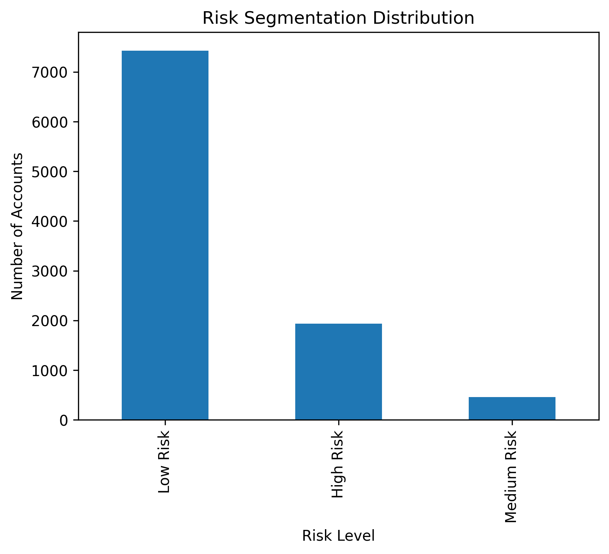

# Выявление мошеннических Ethereum-кошельков

Проект направлен на выявление мошеннических Ethereum-кошельков с использованием поведенческого анализа и моделей машинного обучения.

В рамках проекта были реализованы:
- ETL-процесс и подготовка данных
- feature engineering и создание риск-индикаторов
- сравнение нескольких моделей машинного обучения
- анализ ключевых факторов риска
- система fraud risk scoring для Ethereum-кошельков

Итогом проекта является risk-scored dataset, позволяющий выявлять и приоритизировать высокорисковые кошельки для дальнейшего анализа и расследования.

---

# Датасет

В проекте используется датасет Kaggle Ethereum Fraud Detection Dataset:

- Источник:  
https://www.kaggle.com/datasets/vagifa/ethereum-frauddetection-dataset

- Локальный путь:

```text
./data/raw_ethereum_wallet_dataset.csv
```

---

# Описание данных

Датасет содержит поведенческие и транзакционные характеристики Ethereum-кошельков, связанных как с нормальной, так и с потенциально мошеннической активностью.

В данных представлены:
- частота и временные характеристики транзакций
- показатели баланса кошельков
- особенности отправки и получения средств
- ERC20-активность
- паттерны взаимодействия адресов
- сетевые и поведенческие риск-индикаторы

Индикатор мошенничества:
- `flag`
  - `1` = мошеннический кошелек
  - `0` = нормальный кошелек

---

# Структура проекта

```text
ethereum-wallet-fraud-detection/
│
├── data/
│   ├── raw_ethereum_wallet_dataset.csv
│   ├── processed_wallet_fraud_dataset.parquet
│   └── risk_scored_wallets.csv
│
├── notebooks/
│   ├── ethereum_wallet_fraud_etl.ipynb
│   └── ethereum_wallet_fraud_modeling.ipynb
│
├── images/
│   ├── rf_feature_importance.png
│   └── risk_distribution.png
│
└── README.md
```

---

# ETL процесс

ETL pipeline реализован в:

```text
./notebooks/ethereum_wallet_fraud_etl.ipynb
```

Основные этапы обработки данных:
- проверка качества данных
- обработка отсутствующих данных
- проверка повторяющихся кошельков
- feature engineering
- логарифмические преобразования
- создание поведенческих ratio-based признаков
- подготовка датасета для моделирования

Обработанный датасет:

```text
./data/processed_wallet_fraud_dataset.parquet
```

---

# Модели машинного обучения

В проекте были реализованы и сравнены следующие модели:

1. Logistic Regression  
2. Decision Tree  
3. Random Forest  
4. Gradient Boosting  

Процесс моделирования реализован в:

```text
./notebooks/ethereum_wallet_fraud_modeling.ipynb
```

---

# Сравнение производительности моделей

Для оценки моделей использовались:
- Accuracy (точность классификации)
- Precision (точность положительных предсказаний)
- Recall (полнота выявления мошенничества)
- F1-score (сбалансированная метрика precision и recall)
- ROC-AUC (способность модели различать классы)

Модель Random Forest была выбрана в качестве основной благодаря наиболее сбалансированным результатам по выявлению мошеннической активности и контролю ложноположительных срабатываний.

## Таблица cравнения моделей

| Model | Accuracy | Precision | Recall | F1-score | ROC-AUC |
|---|---:|---:|---:|---:|---:|
| **Random Forest** | **0.959** | **0.916** | **0.898** | **0.907** | **0.989** |
| Gradient Boosting | 0.963 | 0.955 | 0.876 | 0.914 | 0.989 |
| Logistic Regression | 0.867 | 0.642 | 0.907 | 0.752 | 0.946 |
| Decision Tree | 0.925 | 0.888 | 0.760 | 0.819 | 0.942 |

---

# Ключевые факторы риска

Анализ feature importance был проведен с использованием модели Random Forest с дополнительной проверкой результатов через Gradient Boosting.

Наиболее значимыми риск-индикаторами оказались:
- паттерны взаимодействия адресов
- временные характеристики транзакционной активности
- объем транзакций
- активность баланса кошельков
- соотношение отправленных и полученных средств

## Важность признаков Random Forest

<p align="center">
  
</p>

---

# Fraud risk scoring

На финальном этапе проекта каждому Ethereum-кошельку был присвоен fraud risk score на основе вероятностей, рассчитанных моделью Random Forest.

Кошельки были разделены на категории:
- High Risk
- Medium Risk
- Low Risk

Это позволяет:
- приоритизировать высокорисковые кошельки
- поддерживать risk-based monitoring
- оптимизировать процесс анализа подозрительной активности

## Risk score распределение

<p align="center">
  
</p>

Финальный датасет с risk score:

```text
./data/risk_scored_wallets.csv
```

---

# Tools & libraries

- Python
- pandas
- NumPy
- scikit-learn
- matplotlib
- Jupyter Notebook

---

# Основные результаты

- Разработан end-to-end pipeline для выявления мошеннических Ethereum-кошельков
- Проведено сравнение нескольких моделей машинного обучения
- Ensemble-модели показали near-perfect ROC-AUC (~0.99)
- Выявлены ключевые поведенческие риск-индикаторы
- Реализована система fraud risk scoring для оценки риска на уровне кошельков

---

# Возможные улучшения

Возможные направления дальнейшего развития проекта:
- внедрение XGBoost или LightGBM
- SHAP-based explainability
- graph/network analytics
- оптимизация decision threshold
- real-time monitoring Ethereum-кошельков
